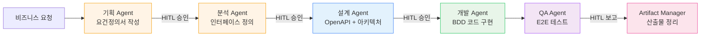

# Antigravity Multi-Agent System

이 디렉토리는 소프트웨어 개발 생명주기(SDLC)를 커버하는 6개의 전문화된 AI 에이전트 규칙을 포함합니다.

**마지막 업데이트**: 2026-02-19 | **버전**: 2.1

---

## 🤖 에이전트 목록

| # | 에이전트 | 파일 | 역할 | 주요 산출물 |
|---|---------|------|------|-----------|
| 1 | 기획 Agent | `01-pm-agent.md` | 요구사항 정의 및 문서화 | 요건정의서, TC, Glossary |
| 2 | 분석 Agent | `02-logic-agent.md` | 비즈니스 분석 및 인터페이스 정의 | 인터페이스 정의서, ERD, 시퀀스 다이어그램 |
| 3 | 설계 Agent | `03-interface-agent.md` | 시스템 아키텍처 설계 | OpenAPI Spec, 아키텍처 문서, MSA 설계 |
| 4 | 개발 Agent | `04-dev-agent.md` | 코드 구현 및 단위 테스트 | 소스코드, BDD 테스트, REST Client 파일 |
| 5 | QA Agent | `05-qa-agent.md` | 품질 보증 및 E2E 테스트 | Playwright 테스트, 테스트 리포트 |
| 6 | Artifact Manager | `06-artifact-manager.md` | 산출물 관리 및 메타데이터 관리 | 산출물 인덱스, metadata.json, Glossary |

---

## 🚀 에이전트 활성화 방법

### 방법 1: 순차적 활성화 (권장)

```markdown
# Step 1: 요건 정의
@[antigravity/rules/01-pm-agent.md]
@[antigravity/rules/prompt-for-requirement.md]

# Step 2: 분석 (요건정의서 승인 후)
@[antigravity/rules/02-logic-agent.md]

# Step 3: 설계 (분석 문서 승인 후)
@[antigravity/rules/03-interface-agent.md]

# Step 4: 개발 (설계 문서 승인 후)
@[antigravity/rules/04-dev-agent.md]

# Step 5: QA (개발 완료 후)
@[antigravity/rules/05-qa-agent.md]

# Step 6: 산출물 관리 (QA 완료 후)
@[antigravity/rules/06-artifact-manager.md]
```

> **💡 HITL(Human-In-The-Loop)**: 각 단계 완료 후 사용자 승인을 받아야 다음 단계로 진행합니다.

### 방법 2: 특정 에이전트만 활성화

```markdown
# 기획만 필요한 경우
@[antigravity/rules/01-pm-agent.md]

# 개발만 필요한 경우
@[antigravity/rules/04-dev-agent.md]

# QA만 필요한 경우
@[antigravity/rules/05-qa-agent.md]
```

### 방법 3: 전체 에이전트 동시 활성화

```markdown
@[antigravity/rules/01-pm-agent.md]
@[antigravity/rules/02-logic-agent.md]
@[antigravity/rules/03-interface-agent.md]
@[antigravity/rules/04-dev-agent.md]
@[antigravity/rules/05-qa-agent.md]
@[antigravity/rules/06-artifact-manager.md]
```

---

## 📋 워크플로우



---

## 📊 산출물 디렉토리 구조

```
docs/[프로젝트명]/
├── 01-requirements/          # 기획 Agent 산출물
│   ├── 01-requirements-spec.md
│   ├── 02-test-cases.md
│   └── 03-glossary.md
├── 02-analysis/              # 분석 Agent 산출물
│   ├── 01-interface-spec.md
│   ├── 02-business-logic-detail.md
│   ├── 03-data-model.md
│   └── 04-sequence-diagrams.md
├── 03-design/                # 설계 Agent 산출물
│   ├── 01-openapi.yaml
│   ├── 02-architecture.md
│   ├── 03-msa-design.md
│   └── 04-tech-stack.md
├── 04-dev/                   # 개발 Agent 산출물
│   └── 01-sanity-test-report.md
├── 05-qa/                    # QA Agent 산출물
│   ├── 01-e2e-test-report.md
│   ├── 02-test-coverage.md
│   └── 03-bug-report.md (결함 발견 시)
└── 06-artifacts/                # Artifact Manager 산출물
│   ├── artifact-index.md
│   ├── metadata.json
│   └── changelog.md
├── Glossary-[프로젝트명].md     # 최종 통합 Glossary 산출물
├── project-context.md           # 프로젝트 전체 컨텍스트 산출물

```

---

## 🔧 설정 파일

### `prompt-for-requirement.md`
기획 Agent가 사용하는 요건정의서 생성 프롬프트 템플릿.

**생성 산출물**:
1. 업무요건 정의서 (우선순위 P0~P2)
2. 핵심 예외 케이스 10선 (EC-ID 매핑)
3. 리스크 기반 테스트 케이스 (TC-ID 매핑)

### `../develop-rules.md`
개발 Agent가 준수하는 코딩 규칙.

**핵심 규칙**:
- Kotlin/Spring Boot 3.x 베스트 프랙티스
- ISMS-P 보안 코딩 (입력 검증, XSS/SQL Injection 방지)
- 환경 분리 (`application-{local|dev|stg|prod}.yml`)
- 파일 헤더 필수 (`// File: [경로]`)

---

## 🎯 베스트 프랙티스

1. **순차적 진행**: 각 단계를 순서대로 진행하여 품질 보장
2. **HITL 승인**: 각 단계마다 Human-in-the-Loop 승인 획득
3. **산출물 검증**: 다음 단계로 넘어가기 전 완성도 확인
4. **ID 연결**: 요건-예외-TC-API-코드를 ID로 추적 가능하게 관리
5. **Glossary 관리**: 용어 일관성을 위해 Artifact Manager가 최종 통합 정리

---

## 📚 참고 문서

- [개발 규칙](../develop-rules.md) - Kotlin/Spring Boot 코딩 표준
- [프로젝트 컨텍스트](../project-context.md) - 현재 진행 중인 프로젝트 현황
