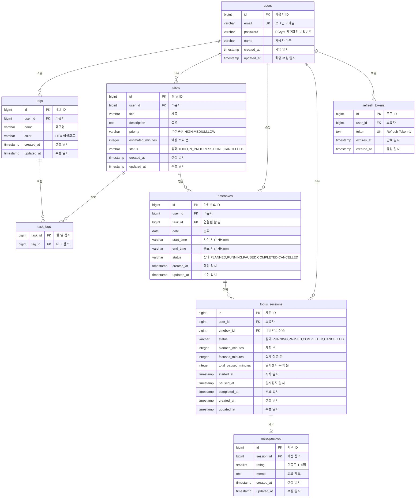

# 데이터 모델: Timebox Planner

**버전**: v1.0 | **작성일**: 2026-02-28 | **작성자**: Logic Agent

---

## 1. 엔티티 목록

| 엔티티 | 테이블명 | 설명 |
|-------|--------|------|
| User | users | 서비스 사용자 |
| Tag | tags | 사용자 정의 태그 |
| Task | tasks | 할 일 항목 |
| TaskTag | task_tags | Task-Tag 연관 (N:M) |
| Timebox | timeboxes | 시간 블록 |
| FocusSession | focus_sessions | 집중 타이머 세션 |
| Retrospective | retrospectives | 세션 회고 |
| RefreshToken | refresh_tokens | JWT Refresh Token |

---

## 2. ERD

---

## 3. 엔티티 상세 정의

### 3.1 users 테이블

| 컬럼 | 타입 | 제약조건 | 설명 |
|-----|------|---------|------|
| id | BIGINT | PK, AUTO_INCREMENT | 사용자 ID |
| email | VARCHAR(255) | NOT NULL, UNIQUE | 로그인 이메일 (소문자 정규화) |
| password | VARCHAR(255) | NOT NULL | BCrypt 해시 비밀번호 |
| name | VARCHAR(100) | NOT NULL | 사용자 이름 |
| created_at | TIMESTAMP | NOT NULL, DEFAULT now() | 가입 일시 |
| updated_at | TIMESTAMP | NOT NULL | 최종 수정 일시 |

### 3.2 tasks 테이블

| 컬럼 | 타입 | 제약조건 | 설명 |
|-----|------|---------|------|
| id | BIGINT | PK, AUTO_INCREMENT | Task ID |
| user_id | BIGINT | NOT NULL, FK → users.id | 소유자 |
| title | VARCHAR(200) | NOT NULL | 제목 |
| description | TEXT | NULL | 설명 |
| priority | VARCHAR(20) | NOT NULL, DEFAULT 'MEDIUM' | HIGH/MEDIUM/LOW |
| estimated_minutes | INTEGER | NULL, CHECK (% 5 = 0) | 예상 소요 시간 |
| status | VARCHAR(20) | NOT NULL, DEFAULT 'TODO' | 상태 |
| created_at | TIMESTAMP | NOT NULL, DEFAULT now() | |
| updated_at | TIMESTAMP | NOT NULL | |

### 3.3 timeboxes 테이블

| 컬럼 | 타입 | 제약조건 | 설명 |
|-----|------|---------|------|
| id | BIGINT | PK, AUTO_INCREMENT | Timebox ID |
| user_id | BIGINT | NOT NULL, FK → users.id | 소유자 |
| task_id | BIGINT | NULL, FK → tasks.id | 연결 Task |
| date | DATE | NOT NULL | 날짜 |
| start_time | TIME | NOT NULL | 시작 시간 (30분 단위) |
| end_time | TIME | NOT NULL | 종료 시간 (30분 단위) |
| status | VARCHAR(20) | NOT NULL, DEFAULT 'PLANNED' | 상태 |
| created_at | TIMESTAMP | NOT NULL | |
| updated_at | TIMESTAMP | NOT NULL | |

**제약조건**: `UNIQUE(user_id, date, start_time)` (중복 방지)

### 3.4 focus_sessions 테이블

| 컬럼 | 타입 | 제약조건 | 설명 |
|-----|------|---------|------|
| id | BIGINT | PK, AUTO_INCREMENT | 세션 ID |
| user_id | BIGINT | NOT NULL, FK | 소유자 |
| timebox_id | BIGINT | NOT NULL, FK → timeboxes.id | 연결 Timebox |
| status | VARCHAR(20) | NOT NULL | 세션 상태 |
| planned_minutes | INTEGER | NOT NULL | 계획 분 |
| focused_minutes | INTEGER | NULL | 실제 집중 분 (완료 시 계산) |
| total_paused_minutes | INTEGER | NOT NULL, DEFAULT 0 | 일시정지 누적 시간 |
| started_at | TIMESTAMP | NOT NULL | 시작 일시 |
| paused_at | TIMESTAMP | NULL | 일시정지 시작 일시 |
| completed_at | TIMESTAMP | NULL | 완료 일시 |

---

## 4. 인덱스 전략

| 테이블 | 인덱스 | 컬럼 | 목적 |
|-------|-------|------|------|
| tasks | idx_tasks_user_status | (user_id, status) | 사용자별 상태 필터링 |
| tasks | idx_tasks_user_priority | (user_id, priority) | 우선순위 정렬 |
| timeboxes | idx_timeboxes_user_date | (user_id, date) | 날짜별 조회 |
| timeboxes | idx_timeboxes_overlap_check | (user_id, date, start_time, end_time) | 중복 방지 |
| focus_sessions | idx_sessions_user_status | (user_id, status) | 실행 중 세션 조회 |
| focus_sessions | idx_sessions_timebox | (timebox_id) | Timebox별 세션 조회 |
| tags | idx_tags_user_id | (user_id) | 사용자 태그 전체 조회 |
| refresh_tokens | idx_refresh_tokens_user | (user_id) | 사용자 토큰 조회 |
