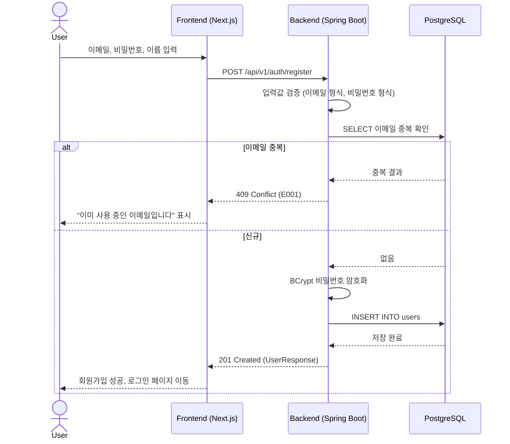
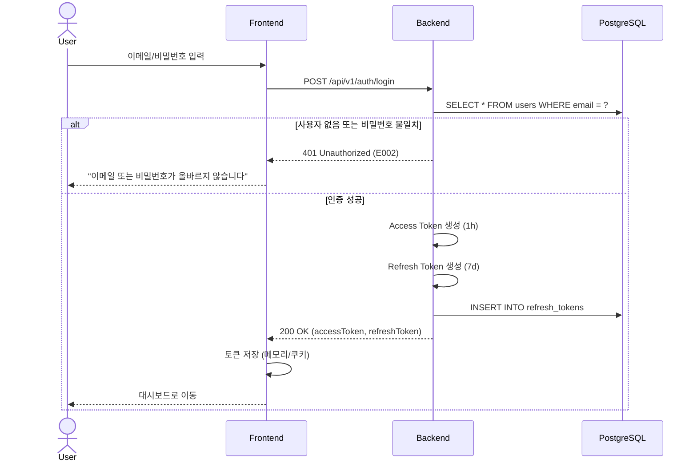
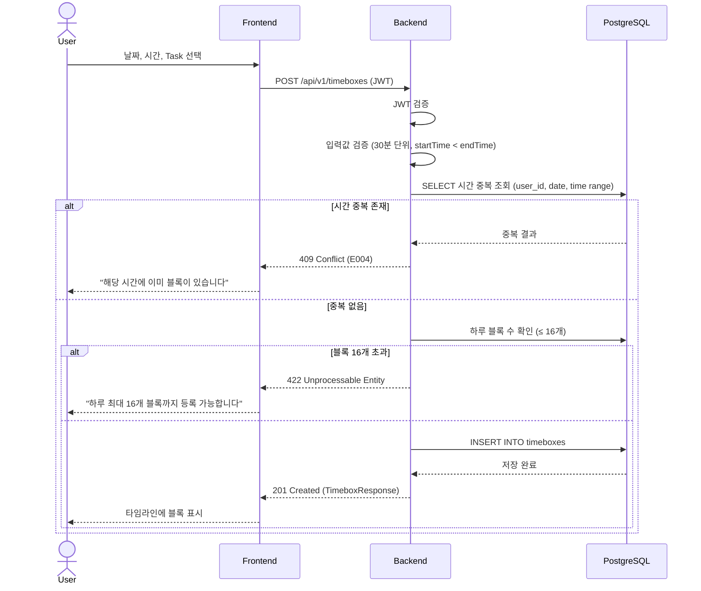
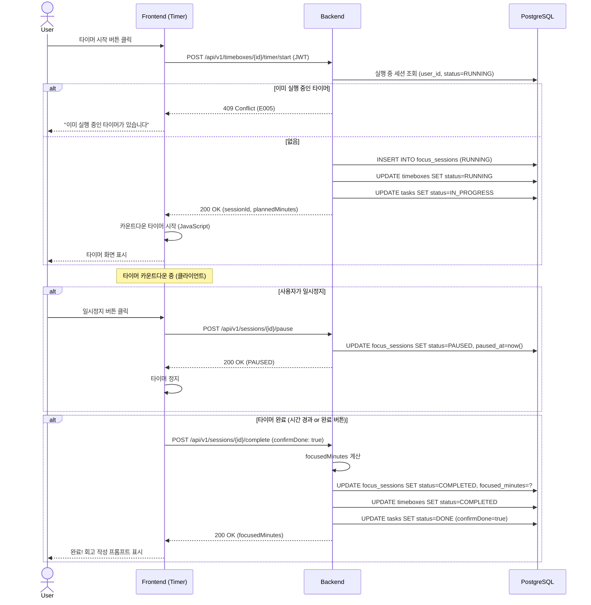
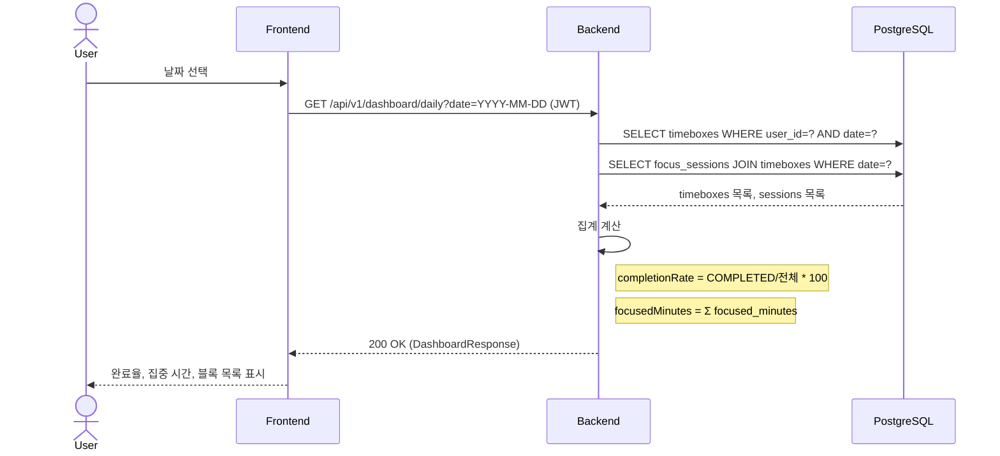
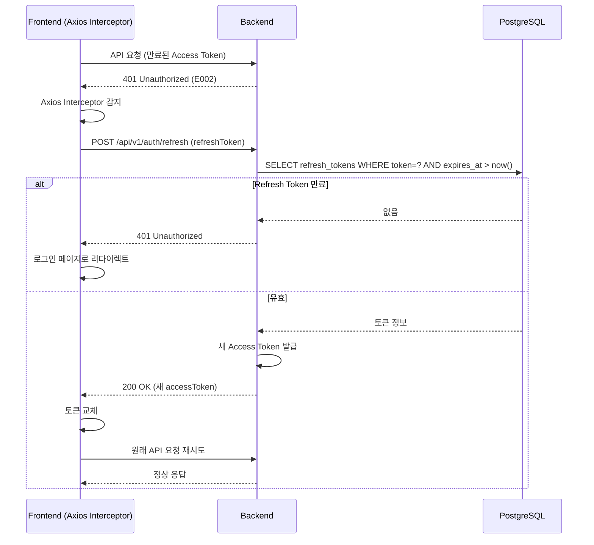
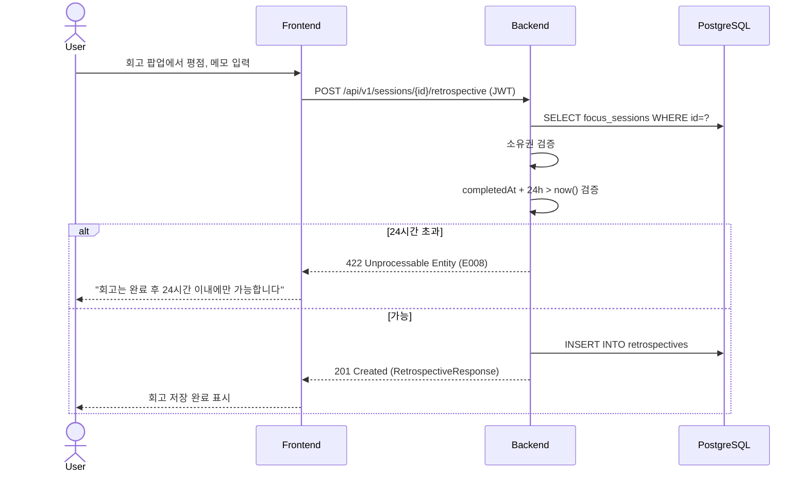

# 시퀀스 다이어그램: Timebox Planner

**버전**: v1.0 | **작성일**: 2026-02-28 | **작성자**: Logic Agent

---

## SD-001: 회원 가입 흐름

---

## SD-002: 로그인 및 JWT 발급

---

## SD-003: Timebox 블록 생성

---

## SD-004: 집중 타이머 시작 → 완료

---

## SD-005: 일별 대시보드 조회

---

## SD-006: 토큰 갱신 (자동)

---

## SD-007: 세션 회고 작성

