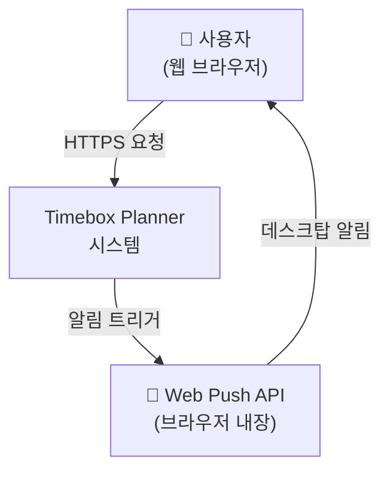
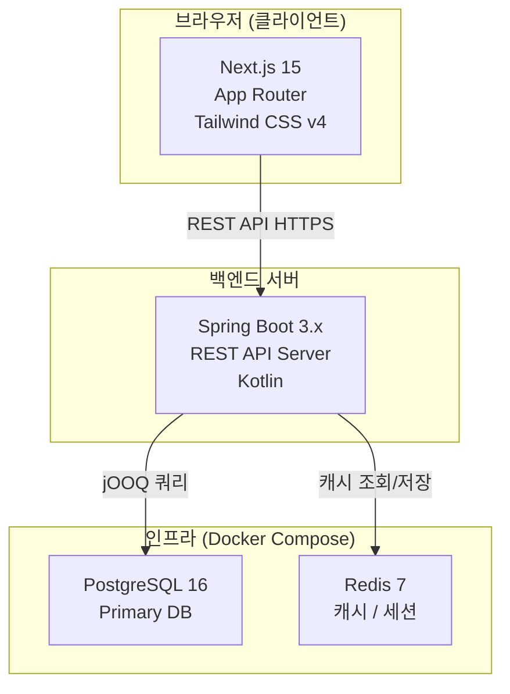
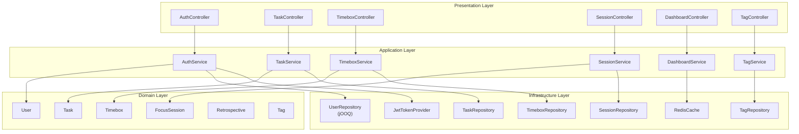
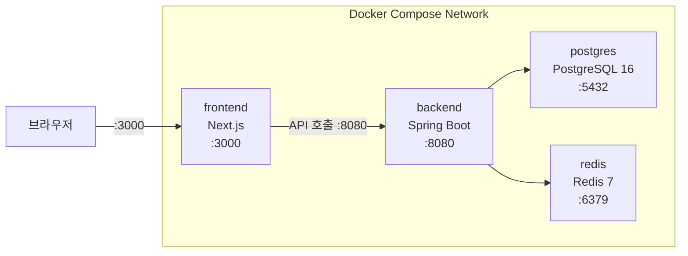
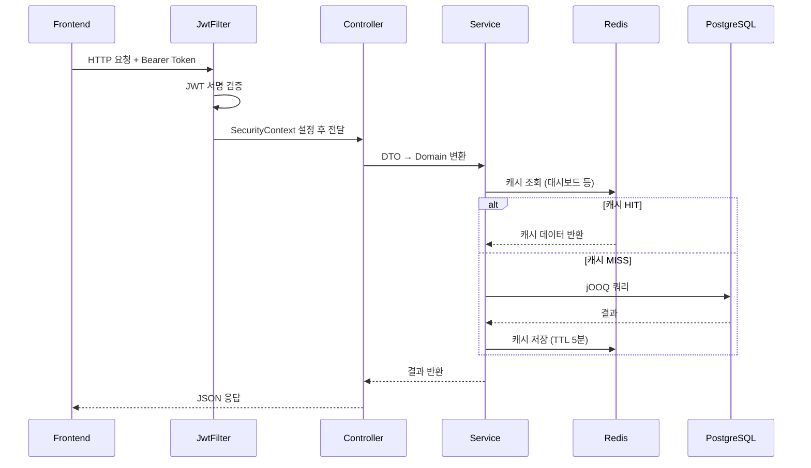

# 시스템 아키텍처: Timebox Planner

**버전**: v1.0 | **작성일**: 2026-02-28 | **작성자**: Interface Agent (설계 Agent)

---

## 1. 전체 시스템 구성도 (C4 Model)

### Level 1 – Context Diagram



### Level 2 – Container Diagram



### Level 3 – Component Diagram (Backend)



---

## 2. 레이어 아키텍처

```
┌─────────────────────────────────────────────┐
│         Presentation Layer                   │
│  @RestController, @RequestMapping            │
│  DTO 변환, 요청/응답 직렬화, 예외 처리           │
├─────────────────────────────────────────────┤
│         Application Layer                    │
│  @Service, Use Case 구현                     │
│  트랜잭션 경계(@Transactional), 비즈니스 흐름    │
├─────────────────────────────────────────────┤
│         Domain Layer                         │
│  도메인 엔티티, 값 객체, 도메인 서비스             │
│  비즈니스 규칙 캡슐화                           │
├─────────────────────────────────────────────┤
│         Infrastructure Layer                 │
│  jOOQ Repository 구현, JWT, Redis, 이메일      │
│  외부 시스템 연동                               │
└─────────────────────────────────────────────┘
```

---

## 3. 배포 아키텍처 (Docker Compose - 로컬)



---

## 4. 보안 아키텍처

```
요청 흐름:
Client → [HTTPS] → Spring Security Filter Chain → Controller

Spring Security Filter Chain:
1. JwtAuthenticationFilter     - Authorization 헤더에서 JWT 추출 및 검증
2. UsernamePasswordAuthFilter  - 로그인 처리 (비활성화, JWT 방식)
3. SecurityContextHolder       - 인증 정보 저장

JWT 전략:
- Access Token:  1시간, 메모리/쿠키 저장
- Refresh Token: 7일, HttpOnly 쿠키 또는 DB 저장
- 서명 알고리�m: HS512

RBAC:
- ROLE_USER: 모든 자원 본인 소유 기준 CRUD
- 소유권 검사: Service 계층에서 userId 비교
```

---

## 5. 데이터 흐름도


