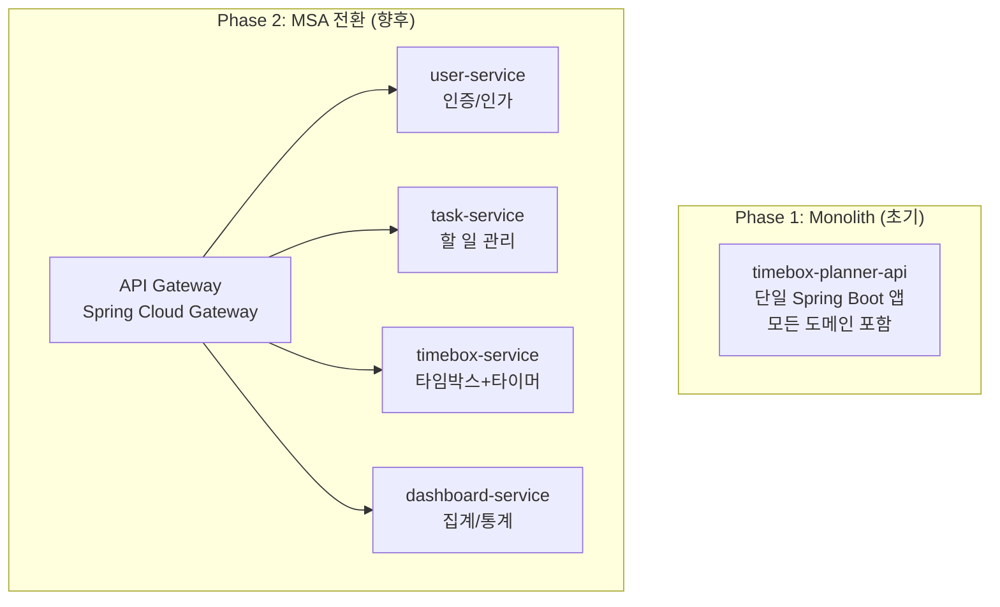
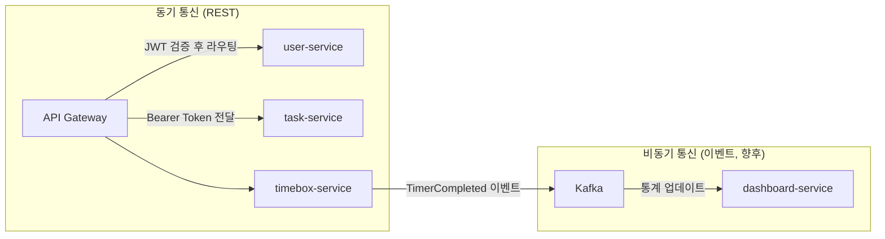

# MSA 설계: Timebox Planner

**버전**: v1.0 | **작성일**: 2026-02-28 | **작성자**: Interface Agent

> **참고**: 초기 버전은 **Monolith 선 구현 → MSA 점진적 분리** 전략을 채택합니다.
> 현재 문서는 향후 MSA 전환을 위한 Bounded Context 설계를 포함합니다.

---

## 1. 서비스 분리 전략 (Bounded Context)



### Bounded Context 정의

| 컨텍스트 | 서비스명 | 책임 | 데이터 오너십 |
|---------|--------|------|------------|
| Identity | user-service | 회원가입, 로그인, JWT 발급 | users, refresh_tokens |
| Productivity | task-service | Task CRUD, Tag 관리 | tasks, tags, task_tags |
| Timebox | timebox-service | Timebox, 타이머, 회고 | timeboxes, focus_sessions, retrospectives |
| Analytics | dashboard-service | 대시보드 집계, 통계 | 읽기 전용 (CQRS Read Model) |

---

## 2. 서비스 간 통신

### Phase 1 (Monolith)
```
모든 서비스 내부 메서드 호출 (in-process)
트랜잭션 경계: @Transactional 단일 트랜잭션
```

### Phase 2 (MSA 전환 후)



**동기 통신 원칙**:
- 서비스 간 인증: API Gateway에서 JWT 검증 후 `X-User-Id` 헤더 전달
- Timeout: 5초 기본, 재시도 3회
- Circuit Breaker: Resilience4j (50% 이상 실패 시 Open)

---

## 3. API Gateway 설계 (Phase 2)

```yaml
# Spring Cloud Gateway 라우팅 설정 예시
routes:
  - id: user-service
    uri: lb://user-service
    predicates:
      - Path=/api/v1/auth/**
    filters:
      - name: CircuitBreaker
        args:
          name: userService

  - id: task-service
    uri: lb://task-service
    predicates:
      - Path=/api/v1/tasks/**, /api/v1/tags/**
    filters:
      - name: JwtAuthentication   # JWT 검증 필터
      - name: AddUserIdHeader     # X-User-Id 헤더 주입

  - id: timebox-service
    uri: lb://timebox-service
    predicates:
      - Path=/api/v1/timeboxes/**, /api/v1/sessions/**
    filters:
      - name: JwtAuthentication
      - name: AddUserIdHeader
      - name: RateLimiter         # Rate Limiting
        args:
          redis-rate-limiter.replenishRate: 100
          redis-rate-limiter.burstCapacity: 200

  - id: dashboard-service
    uri: lb://dashboard-service
    predicates:
      - Path=/api/v1/dashboard/**
    filters:
      - name: JwtAuthentication
      - name: AddUserIdHeader
```

---

## 4. 데이터 관리 전략

### Phase 1 (Monolith)
- 단일 PostgreSQL DB, 스키마로 논리 분리

### Phase 2 (MSA - Database per Service)
```
user-service      → user_db (PostgreSQL)
task-service      → task_db (PostgreSQL)
timebox-service   → timebox_db (PostgreSQL)
dashboard-service → dashboard_db (Redis 캐시 + PostgreSQL 읽기전용)
```

---

## 5. Circuit Breaker 패턴

```kotlin
// Resilience4j 적용 예시 (Phase 2)
@CircuitBreaker(name = "taskService", fallbackMethod = "getTasksFallback")
fun getTasks(userId: Long): List<TaskResponse> {
    return taskServiceClient.getTasks(userId)
}

fun getTasksFallback(userId: Long, ex: Exception): List<TaskResponse> {
    // 빈 목록 반환 또는 캐시에서 조회
    return redisCache.getOrElse("tasks:$userId") { emptyList() }
}
```

**설정값**:
- `slidingWindowSize`: 10
- `failureRateThreshold`: 50 (%)
- `waitDurationInOpenState`: 30초
- `permittedCallsInHalfOpenState`: 3

---

## 6. ADR (Architecture Decision Record)

### ADR-001: Monolith 우선 개발 전략
- **Context**: 초기 서비스로 복잡한 MSA 오버헤드를 피해야 함
- **Decision**: Phase 1에서 Monolith로 구현, Bounded Context 경계는 패키지로 분리
- **Rationale**: 팀 규모가 작고, 도메인 모델이 성숙되지 않은 단계에서 MSA는 over-engineering
- **Consequences**: 향후 MSA 전환 시 패키지 경계가 서비스 분리 기준이 됨

### ADR-002: jOOQ 선택
- **Context**: ORM vs Query Builder 선택
- **Decision**: jOOQ 사용
- **Rationale**: 타입 세이프 SQL, 복잡한 집계 쿼리(대시보드)에서 JPA보다 유리, Kotlin DSL 지원
- **Alternatives**: Spring Data JPA (단순 CRUD에 유리하나 복잡 쿼리 불리)

### ADR-003: Redis 캐시 전략
- **Context**: 대시보드 집계 쿼리가 매 요청마다 실행되면 성능 저하
- **Decision**: 대시보드 응답을 Redis에 TTL 5분으로 캐싱
- **Rationale**: 집계 데이터는 실시간성이 크게 중요하지 않음
- **Consequences**: 타이머 완료 시 해당 날짜 캐시 즉시 무효화 필요
