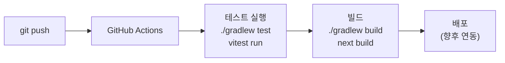

# 기술 스택 명세: Timebox Planner

**버전**: v1.0 | **작성일**: 2026-02-28 | **작성자**: Interface Agent

---

## 1. Backend 기술 스택

| 기술 | 버전 | 선정 이유 | 대안 |
|-----|------|---------|------|
| **Kotlin** | 2.1.x | Null-safety, 간결한 문법, Spring 공식 지원 | Java 21 |
| **Spring Boot** | 3.4.x | 표준 엔터프라이즈 프레임워크, Auto-configuration | Quarkus |
| **Spring Security** | 6.x | JWT 기반 인증/인가 내장 지원 | - |
| **jOOQ** | 3.19.x | 타입 세이프 SQL, 복잡한 집계 쿼리에 강점 | Spring Data JPA |
| **Flyway** | 10.x | DB 스키마 버전 관리, 팀 협업 필수 | Liquibase |
| **Kotest** | 5.9.x | Kotlin 친화적 BDD 테스트, Given-When-Then 내장 | JUnit 5 |
| **MockK** | 1.13.x | Kotlin 전용 Mock 라이브러리, final class 지원 | Mockito |
| **Resilience4j** | 2.x | Circuit Breaker, Rate Limiter (Spring 통합) | Hystrix |

---

## 2. Frontend 기술 스택

| 기술 | 버전 | 선정 이유 | 대안 |
|-----|------|---------|------|
| **Next.js** | 15.x | App Router, SSR/SSG 지원, 풀스택 React 프레임워크 | Vite + React |
| **React** | 19.x | 컴포넌트 기반 UI, 대규모 생태계 | Vue.js |
| **TypeScript** | 5.x | 타입 안전성, IDE 자동완성 | JavaScript |
| **Tailwind CSS** | v4.x | 유틸리티 퍼스트, 빠른 UI 개발 | styled-components |
| **shadcn/ui** | latest | Radix UI 기반, 접근성(a11y) 준수, Tailwind 연동 | Material UI |
| **TanStack Query** | 5.x | 서버 상태 관리, 캐싱, 자동 갱신 | SWR |
| **Zustand** | 5.x | 경량 클라이언트 상태 관리 (타이머 등) | Redux Toolkit |
| **Axios** | 1.x | HTTP 클라이언트, Interceptor로 토큰 자동 갱신 | Fetch API |
| **Vitest** | 2.x | Vite 기반 테스트 러너, Jest 호환 | Jest |
| **Playwright** | 1.x | E2E 테스트, 크로스 브라우저 지원 | Cypress |

### OpenAPI 코드 생성
```bash
# Frontend - TypeScript Axios Client 자동 생성
npx @openapitools/openapi-generator-cli generate \
  -i docs/timebox-planner/03-design/01-openapi.yaml \
  -g typescript-axios \
  -o frontend/src/api/generated

# Backend - Kotlin Spring 코드 스켈레톤 생성
npx @openapitools/openapi-generator-cli generate \
  -i docs/timebox-planner/03-design/01-openapi.yaml \
  -g kotlin-spring \
  -o backend-timebox/src
```

---

## 3. Database 기술 스택

| 기술 | 버전 | 역할 | 선정 이유 |
|-----|------|------|---------|
| **PostgreSQL** | 16.x | Primary DB | ACID 트랜잭션, 복잡 쿼리, JSON 지원 |
| **Redis** | 7.x | 캐시 / 세션 | 인메모리 고속 조회, TTL 기반 캐시 |

### PostgreSQL 설정
```yaml
# application-local.yml
spring:
  datasource:
    url: jdbc:postgresql://localhost:5432/timebox_db
    username: ${DB_USERNAME:timebox}
    password: ${DB_PASSWORD:timebox}
    hikari:
      maximum-pool-size: 10
      minimum-idle: 2
      connection-timeout: 30000
```

### Redis 설정
```yaml
spring:
  data:
    redis:
      host: ${REDIS_HOST:localhost}
      port: ${REDIS_PORT:6379}
      timeout: 2000ms
```

---

## 4. Infrastructure (로컬 개발 – Docker Compose)

```yaml
# docker-compose.yml
version: '3.9'
services:
  postgres:
    image: postgres:16-alpine
    environment:
      POSTGRES_DB: timebox_db
      POSTGRES_USER: timebox
      POSTGRES_PASSWORD: timebox
    ports:
      - "5432:5432"
    volumes:
      - postgres_data:/var/lib/postgresql/data

  redis:
    image: redis:7-alpine
    ports:
      - "6379:6379"
    command: redis-server --appendonly yes
    volumes:
      - redis_data:/data

volumes:
  postgres_data:
  redis_data:
```

---

## 5. CI/CD 파이프라인



### GitHub Actions Workflow (백엔드)
```yaml
# .github/workflows/backend-ci.yml
name: Backend CI

on:
  push:
    branches: [main, step/**]
  pull_request:
    branches: [main]

jobs:
  test:
    runs-on: ubuntu-latest
    services:
      postgres:
        image: postgres:16-alpine
        env:
          POSTGRES_DB: timebox_test
          POSTGRES_USER: timebox
          POSTGRES_PASSWORD: timebox
        ports: ['5432:5432']
    steps:
      - uses: actions/checkout@v4
      - uses: actions/setup-java@v4
        with:
          java-version: '21'
          distribution: 'temurin'
      - name: Run Tests
        run: ./gradlew test
        working-directory: backend-timebox
```

---

## 6. 환경별 설정 파일

| 환경 | 파일 | 특징 |
|-----|------|------|
| 로컬 | `application-local.yml` | Docker Compose localhost 연결, 디버그 로그 |
| 개발 | `application-dev.yml` | 개발 서버 DB 연결, SQL 로그 포함 |
| 스테이징 | `application-stg.yml` | 운영과 동일 설정, 테스트 데이터 |
| 운영 | `application-prod.yml` | 환경 변수 참조, SQL 로그 OFF, HTTPS 강제 |

### 공통 환경 변수
```bash
# .env.local (Git 제외)
DB_USERNAME=timebox
DB_PASSWORD=timebox_secret
REDIS_HOST=localhost
JWT_SECRET=your-256bit-secret-key-here
JWT_EXPIRATION=3600000
JWT_REFRESH_EXPIRATION=604800000
```
